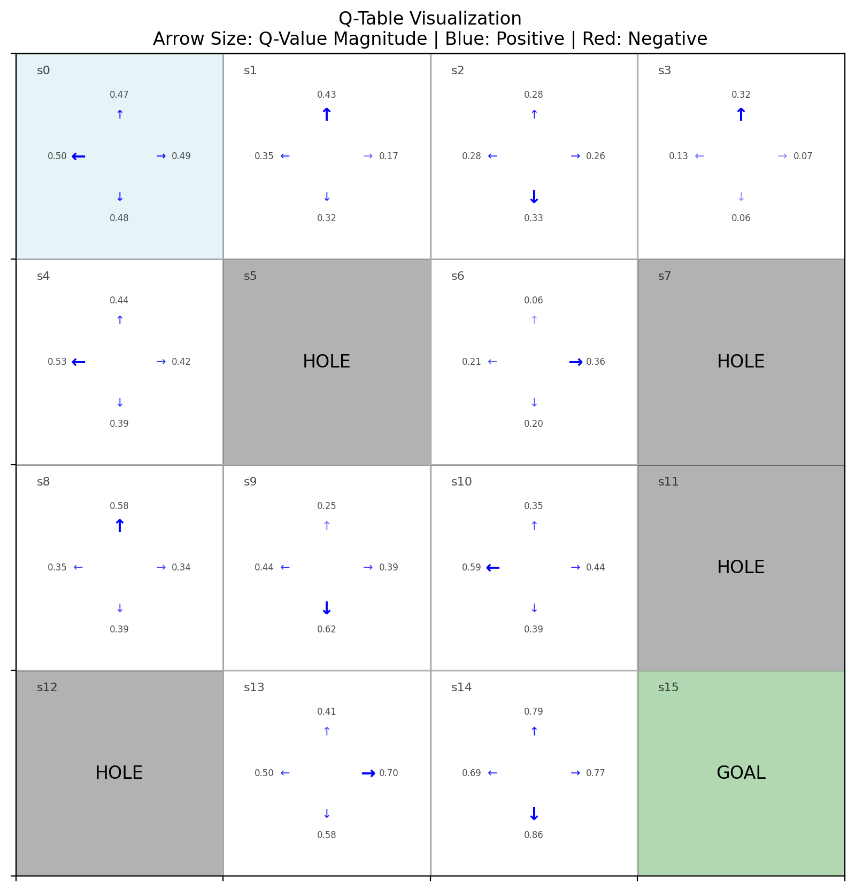
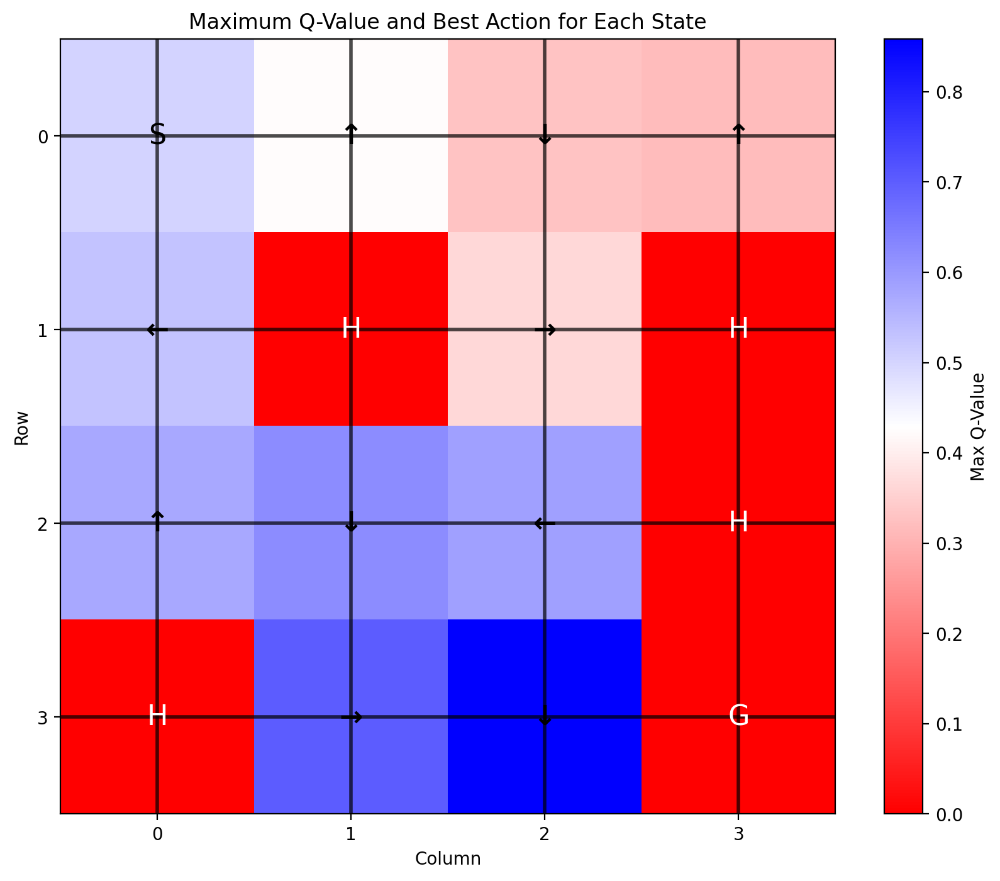
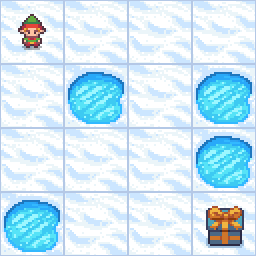
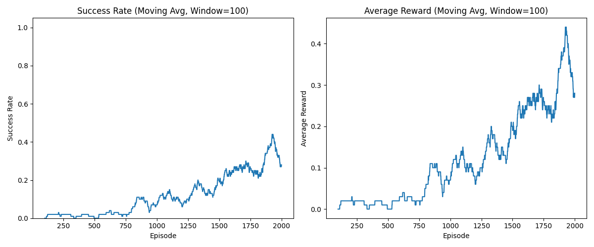

# Reinforcement Learning with Python: Q-Learning in FrozenLake

This repository contains a complete implementation of Q-learning for the FrozenLake environment from OpenAI's Gymnasium. The code demonstrates how reinforcement learning agents learn through interaction with their environment, without explicit programming of the solution.

## Project Overview

The FrozenLake environment provides a simple grid world where an agent must navigate from a starting position to a goal while avoiding holes in the ice. The "slippery" version introduces stochasticity, as the agent's movements may not always result in the intended direction, making the learning task more challenging.

This implementation:
- Creates a Q-learning agent that learns optimal behavior through trial and error
- Tracks and visualizes the learning progress
- Provides tools to test the trained agent
- Creates animations showing the agent's behavior before and after training

## Installation

1. Clone this repository:
```bash
git clone https://github.com/yourusername/reinforcement-learning-python.git
cd reinforcement-learning-python
```

2. Install the required dependencies:
```bash
pip install -r requirements.txt
```

## Usage

The project is organized into modular components that can be run separately or together using the main script.

### Running the Complete Pipeline

To train an agent, test its performance, and generate visualizations:

```bash
python main.py --mode all
```

### Training

To just train the agent:

```bash
python main.py --mode train --episodes 5000
```

You can customize the training parameters:
```bash
python main.py --mode train --episodes 10000 --learning_rate 0.2 --discount_factor 0.95
```

### Testing

To test a previously trained agent:

```bash
python main.py --mode test --test_episodes 10
```

### Visualization

To generate visualizations for a trained agent:

```bash
python main.py --mode visualize
```

## Project Structure

- `environment_setup.py`: Creates and configures the FrozenLake environment
- `q_learning_agent.py`: Implements the Q-learning algorithm
- `training.py`: Contains functions for training the agent and tracking performance
- `visualization.py`: Provides tools to visualize the Q-table and create animations
- `testing.py`: Contains functions for testing the trained agent
- `main.py`: Combines all components for end-to-end execution

## Visualizations

The project generates several visualizations to help understand the Q-learning process and the agent's behavior:

### Q-Table Visualization



This visualization shows the agent's learned policy through the Q-table. For each state (cell) in the environment:
- The background color represents the type of cell (start, frozen, hole, or goal)
- The arrows indicate the available actions in each state
- The size and opacity of each arrow indicate the relative Q-value for that action
- Blue arrows indicate positive Q-values, while red arrows indicate negative ones
- Larger and more opaque arrows represent stronger preferences for those actions

This visualization helps us understand which actions the agent prefers in each state after training.

### Q-Value Heatmap



The heatmap shows the maximum Q-value for each state, with:
- Color intensity representing the magnitude of the Q-value (blue for positive, red for negative)
- Arrows showing the best action in each state
- Special markings for the start (S), holes (H), and goal (G)

This visualization helps us understand how the agent values different states and which paths it considers most valuable.

### Agent Path Animation



This animation shows the agent navigating through the environment using its learned policy. The agent follows the best actions according to the Q-table, demonstrating how it applies what it learned during training.

The animation makes it easy to visualize:
- How the agent navigates from the start to the goal
- How the agent avoids holes
- How the slippery nature of the environment affects the agent's path (sometimes moving in unintended directions)

### Training Performance



This chart shows the agent's performance during training, including:
- Success rate (percentage of episodes where the agent reached the goal)
- Average rewards over time
- Exploration rate (epsilon) decay

These metrics help us understand how the agent's performance improved as it learned the optimal policy.

## Command Line Arguments

The main script accepts various command line arguments to customize the learning process:

```
--mode              Mode to run: 'train', 'test', 'visualize', or 'all'
--episodes          Number of episodes for training (default: 5000)
--slippery          Whether the environment is slippery (default: True)
--learning_rate     Learning rate (alpha) for the agent (default: 0.1)
--discount_factor   Discount factor (gamma) for future rewards (default: 0.99)
--exploration_rate  Initial exploration rate (epsilon) (default: 1.0)
--visualize_training Render the environment during training (flag)
--test_episodes     Number of episodes for testing (default: 5)
```

For a complete list of options:
```bash
python main.py --help
```

## Example Output

After training, the agent typically achieves a success rate of 70-90% in the slippery environment, with each successful episode taking approximately 15-25 steps to reach the goal. The visualizations show how the agent has learned to navigate around holes and find an optimal path to the goal.

## License

This project is licensed under the MIT License - see the LICENSE file for details.

## Acknowledgments

- [OpenAI Gymnasium](https://gymnasium.farama.org/) for providing the reinforcement learning environments
- [NumPy](https://numpy.org/) for numerical operations
- [Matplotlib](https://matplotlib.org/) for visualizations
- [imageio](https://imageio.readthedocs.io/) for creating animations 